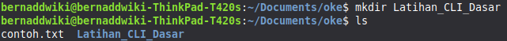
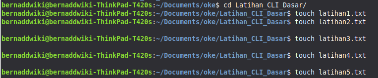
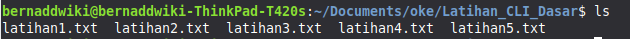
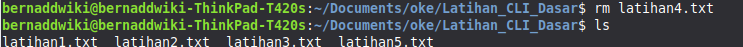
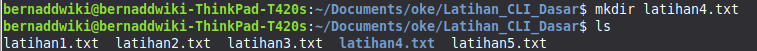
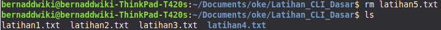
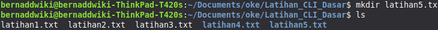
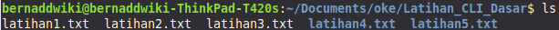
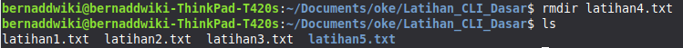

# Minitask CLI

1. Membuat folder "Latihan_CLI_Dasar"

2. Membuat file kosong "latihanX.txt" di dalamnya sebanyak 5(X diganti 1-5)

3. Melihat daftar file yang sudah dbuat

4. Menghapus file dengan urutan ke 4

5. Membuat folder dengan nama "latihan4.txt"

6. Menghapus file dengan urutan ke 5

7. Membuat folder dengan nama "latihan5.txt"

8. Melihat daftar file dan folder yang sudah dibuat

9. Menghapus folder dengan nama "latihan4.txt"

